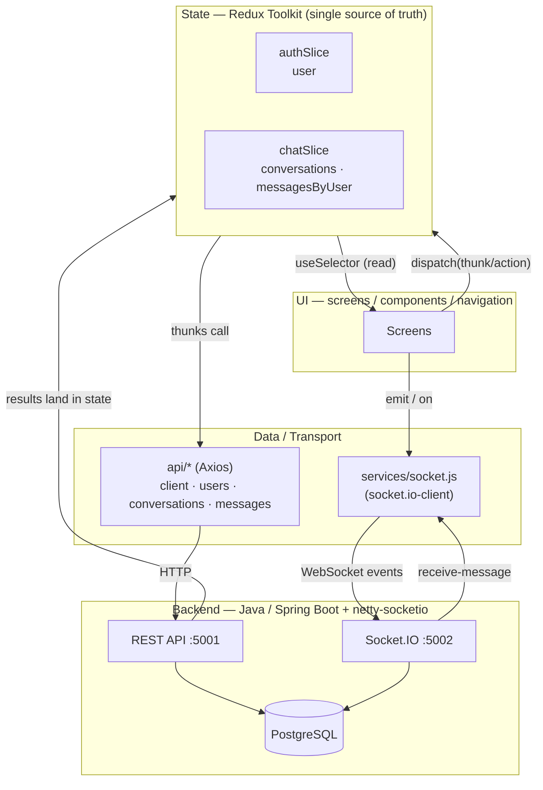
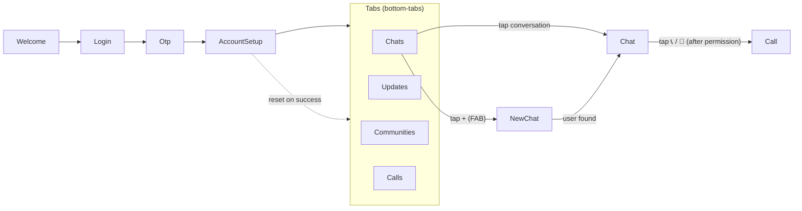
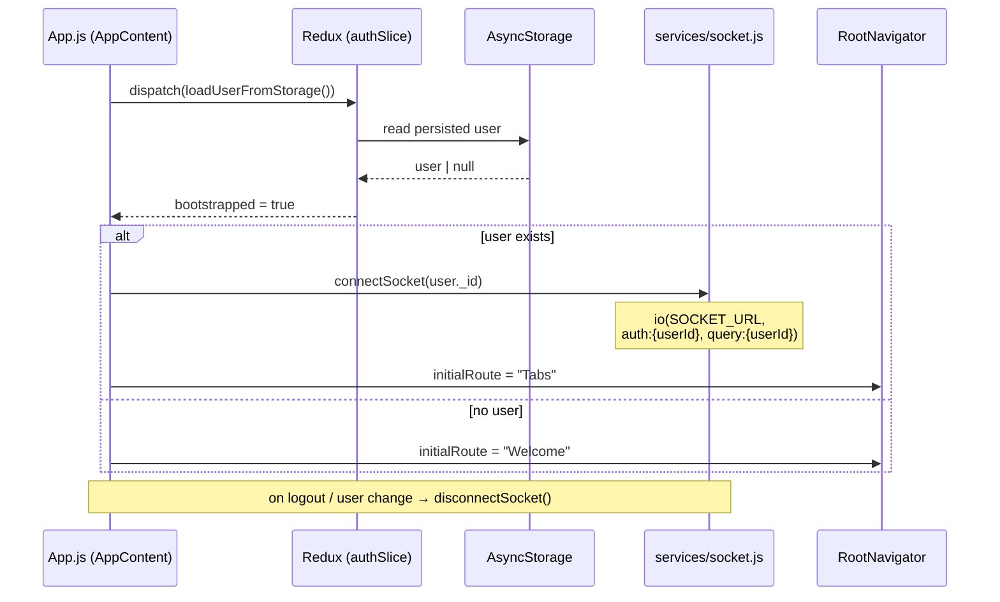
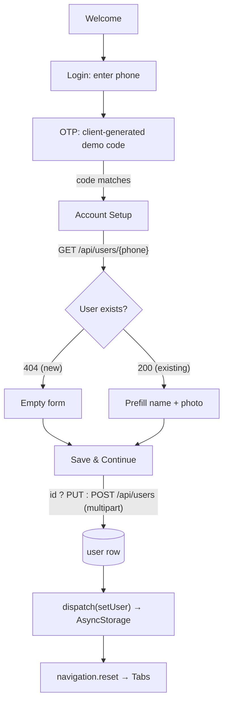
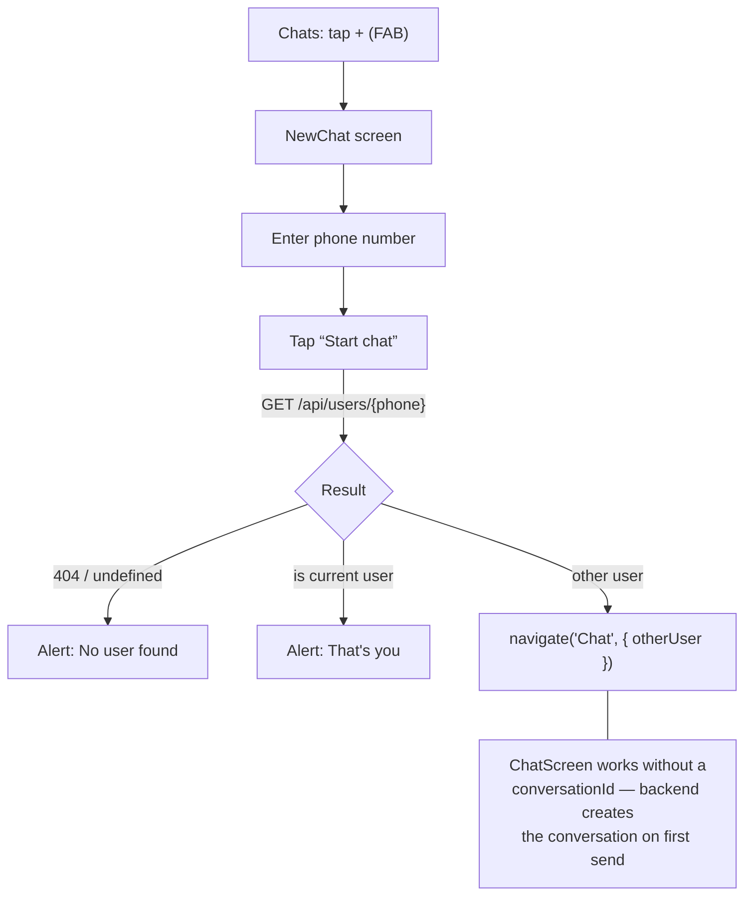
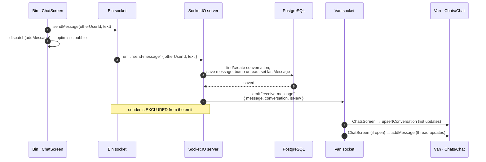
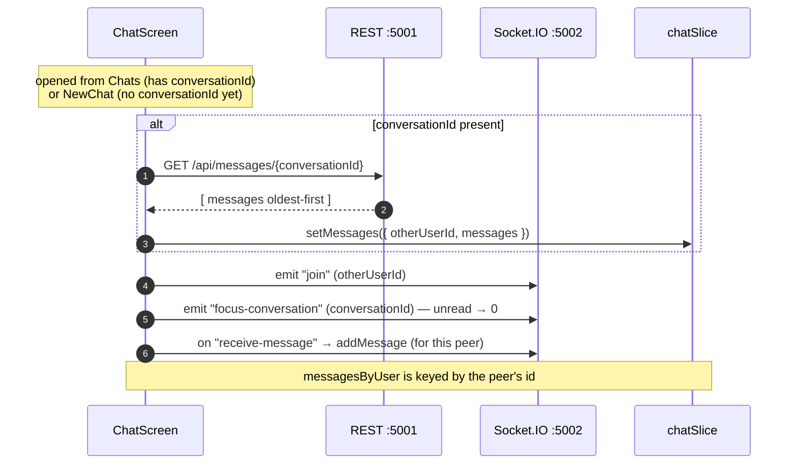
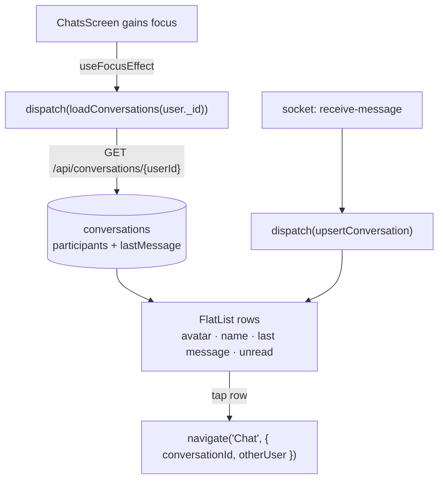
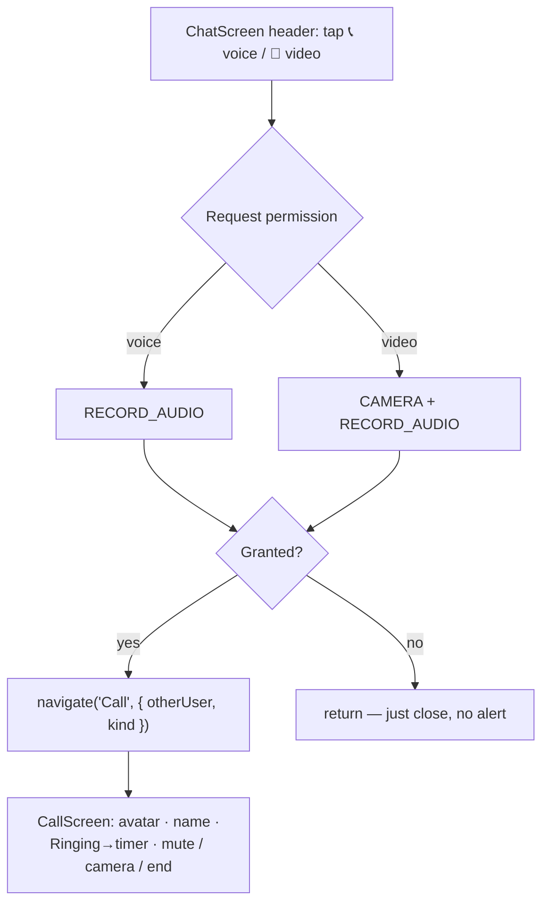
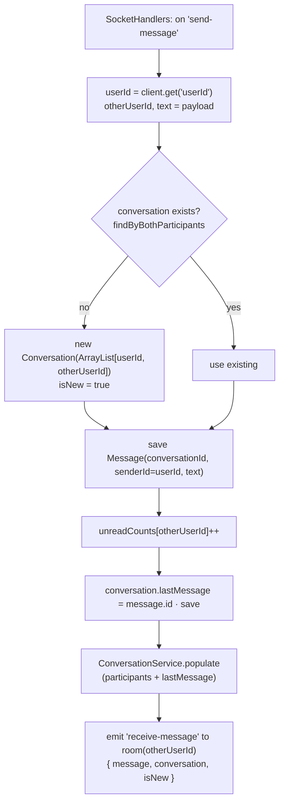

# ChatApp — Chat Flow & Architecture

Diagrams below are written in **Mermaid**. They render automatically in:
- VS Code (install the *Markdown Preview Mermaid Support* extension, then open Preview)
- GitHub / GitLab markdown
- Any Mermaid live editor (https://mermaid.live)

---

## 1. Layered architecture (one-way data flow)

UI reads from Redux via selectors and writes by dispatching thunks/actions.
Data and transport layers are the only boundary to the backend.

---

## 2. Navigation graph

`RootNavigator` chooses the initial route from `auth.user`: **Tabs** when logged in,
otherwise **Welcome**.

---

## 3. Startup & auth lifecycle (`App.js`)

> **Fix applied:** `receive-message` subscribers are stored in a module-level Set in
> `socket.js`, so a screen can subscribe **before** the socket connects (ChatsScreen
> mounts before `connectSocket` runs) and still receive events.

---

## 4. Account funnel (Welcome → Tabs)

---

## 5. Start a new chat (NewChat)

---

## 6. Realtime messaging — send & receive

Bin sends a message to Van. The backend persists it and pushes it to Van's room
(the sender is excluded). The sender shows the message optimistically.

> **Backend fix:** the conversation was created with an **immutable** `List.of(...)`
> for participants; Hibernate's merge on the 2nd save called `clear()` on it →
> `UnsupportedOperationException` → rollback → nothing saved. Now copied into a
> mutable `ArrayList`.
>
> **Client fix:** messages carry `senderId` (backend) or `sender` (optimistic); the
> `senderId()` helper accepts **either**, so live messages are no longer dropped.

---

## 7. Open a chat & load history

> Threads were previously session-only (no history endpoint). A new
> `GET /api/messages/{conversationId}` endpoint + this load make past messages
> appear on both sides.

---

## 8. Conversation list (Chats tab)

> **Avatar fix:** `profileImage` arrives relative (`/uploads/x.jpg`) from the
> conversation populate; `avatarUri()` now absolutizes it to
> `http://<host>:5001/uploads/x.jpg` (and passes through already-absolute / `file://`).

---

## 9. Voice / video call (permission-gated)

> Permissions are declared in `AndroidManifest.xml` (`RECORD_AUDIO`, `CAMERA`).
> The call itself is a **placeholder UI** — wiring `react-native-webrtc` with
> signaling over the existing Socket.IO server would make it a real call.

---

## 10. Backend `send-message` internals

---

## REST & Socket reference

| REST (Axios → `:5001/api`) | Purpose |
|---|---|
| `GET /users/{phone}` | Prefill account setup (404 = new user) |
| `POST /users` (multipart) | Create user |
| `PUT /users/{id}` (multipart) | Update name / profile image |
| `GET /conversations/{userId}` | Conversation list (participants + lastMessage) |
| `GET /messages/{conversationId}` | Message history, oldest-first |

| Socket.IO (`:5002`) | Direction | Payload |
|---|---|---|
| connect (`auth:{userId}`) | client → server | auto-joins personal room |
| `join` | client → server | `otherUserId` |
| `send-message` | client → server | `{ otherUserId, text }` |
| `focus-conversation` | client → server | `conversationId` (unread → 0) |
| `receive-message` | server → client | `{ message, conversation, isNew }` |
