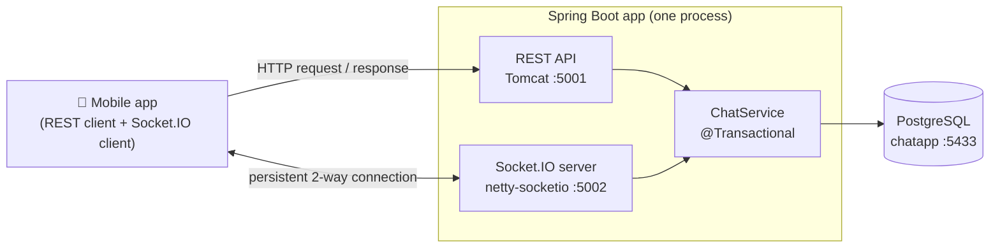
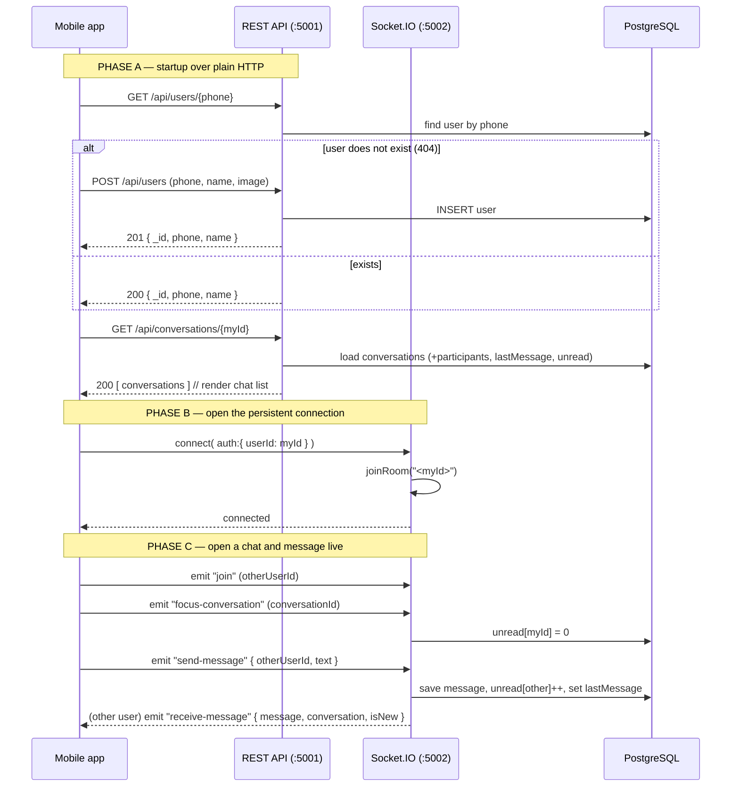
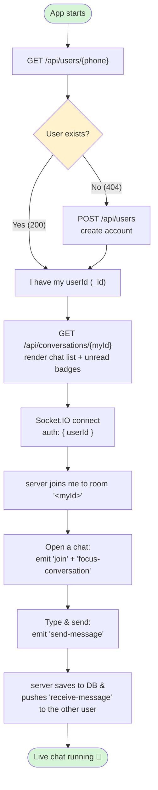
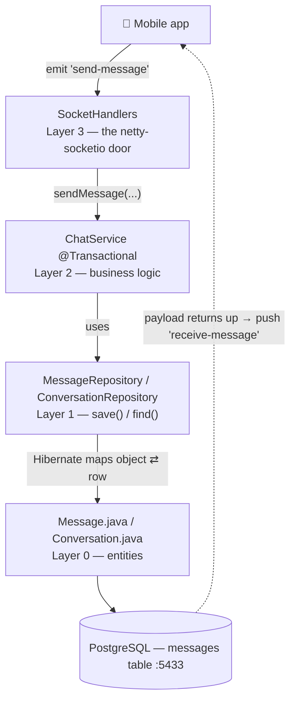
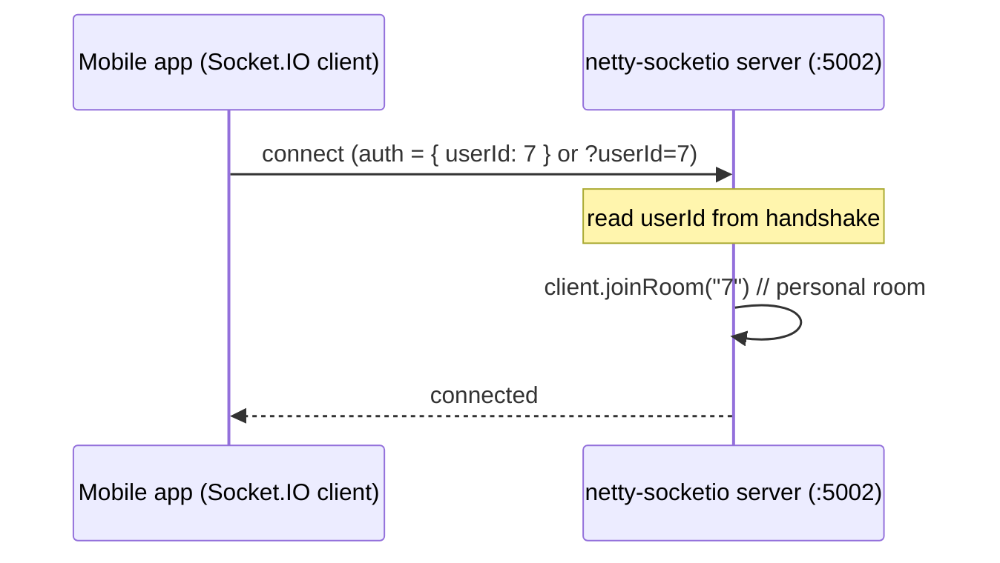

# Socket.IO Guide (for beginners)

A step-by-step walkthrough of how this chat backend works — from **setup &
configuration** all the way to **live messaging** — written for someone brand new
to Socket.IO. It covers the big picture, the connection handshake, "rooms", every
event (with diagrams), how to read the code, the URLs, and what to learn next.

> Diagrams below use **Mermaid**. They render automatically on GitHub and in most
> Markdown viewers (VS Code: install the "Markdown Preview Mermaid Support"
> extension, then open Preview with `Ctrl+Shift+V`). ASCII fallbacks are included.

---

## 0. Start here — your learning path 👣

Follow these steps in order. Each one points to the section that explains it.
Don't skip ahead — every step builds on the previous one.

1. **Understand the idea** — what Socket.IO is and why chat needs it. → [§1](#1-what-is-socketio-and-why-do-we-use-it)
2. **Set it up and run it** — config, ports, start the server, verify it's alive. → [§2](#2-setup--configuration-config--run)
3. **See the big picture** — the two servers (REST + Socket.IO) and the database. → [§3](#3-the-big-picture-architecture)
4. **Follow the full journey** — what calls happen, in order, from app start to live chat. → [§4](#4-the-full-journey-rest-first-then-socketio)
5. **Read the code in order** — open the files config → entity → repository → service → socket. → [§5](#5-reading-the-code-in-order-config--end)
6. **Learn the core concepts** — the handshake → [§6](#6-connecting-the-handshake), rooms → [§7](#7-rooms--the-one-concept-to-really-understand), events → [§8](#8-the-events), the send flow → [§9](#9-sending-a-message--full-flow), disconnect → [§10](#10-disconnect).
7. **Know the URLs** — every endpoint and port in one place. → [§11](#11-urls-local-defaults)
8. **Practice** — run a tiny script and watch messages flow. → [§12](#12-try-it-yourself)
9. **Go further** — the roadmap of topics to study next. → [§13](#13-what-to-learn-next-roadmap)

**The 4 things to remember the whole time:**
- **REST = pull** (you ask, you get one answer). **Socket.IO = push** (the server tells you when something happens).
- Your **`userId`** is the key to everything — you get it from REST first.
- A **room named `"<yourId>"` is your mailbox** — messages for you are delivered there.
- **`emit` = send an event**, **`on` = listen for an event.**

---

## 1. What is Socket.IO and why do we use it?

A normal REST call is **one-shot**: the client asks, the server answers, the
connection closes. That's fine for "get my conversations", but it can't let the
**server push** a new message to you the instant someone sends it.

Socket.IO keeps a **persistent, two-way connection** open (over WebSocket). Either
side can send a message at any time. That's what makes chat feel instant.

| | REST (Spring MVC) | Socket.IO |
|---|---|---|
| Direction | client → server (request/response) | both ways, anytime |
| Connection | opens & closes per call | stays open |
| Used here for | users, conversations list, uploads | live messaging |
| Port | **5001** | **5002** |

In this project the Java server side is the library
`com.corundumstudio:netty-socketio` (a Java implementation of the Socket.IO
protocol). The mobile app uses a Socket.IO **client** library.

---

## 2. Setup & configuration (config → run)

This is where you actually get the backend running. Do it once before anything else.

### 2.1 Prerequisites
- **Docker Desktop** (running — `docker version` should show a *Server* section).
- **Java 17** (only needed if you run the app on your host instead of in Docker).

### 2.2 The config files (what controls host, port, DB)

Everything is driven by environment variables, with safe defaults. You normally
only touch **`.env`**.

| What | Env var | Default | Where it lives in code |
|---|---|---|---|
| REST port | `SERVER_PORT` | `5001` | [application.yml](src/main/resources/application.yml) → `server.port` |
| Socket.IO host | `SOCKETIO_HOST` | `0.0.0.0` (all interfaces) | [application.yml](src/main/resources/application.yml) → `app.socketio.host` |
| Socket.IO port | `SOCKETIO_PORT` | `5002` | [application.yml](src/main/resources/application.yml) → `app.socketio.port` |
| DB connection | `DB_URL` / `DB_USERNAME` / `DB_PASSWORD` | `localhost:5433/chatapp`, `postgres`/`postgres` | [application.yml](src/main/resources/application.yml) → `spring.datasource.*` |
| DB host port | `DB_HOST_PORT` | `5433` | [docker-compose.yml](docker-compose.yml) |
| Upload folder | `UPLOAD_DIR` | `uploads` | [application.yml](src/main/resources/application.yml) → `app.upload-dir` |

**How a value flows:** `.env` → `application.yml` (`${VAR:default}`) → the Java code reads it.
For Socket.IO specifically: [SocketIOConfig.java](src/main/java/com/chatapp/config/SocketIOConfig.java)
reads `@Value("${app.socketio.host}")` / `@Value("${app.socketio.port}")` and calls
`config.setHostname(host)` / `config.setPort(port)` on the netty-socketio server.

- `0.0.0.0` = "listen on every network interface", so a phone on the same Wi-Fi can
  reach it at `http://<your-PC-IP>:5002`. (`localhost` would allow only this machine.)
- To change anything, edit `.env` (e.g. `SOCKETIO_PORT=6002`) — **no code change needed.**

### 2.3 Run it

```bash
# first time only — create your env file
cp .env.example .env

# A) Everything in Docker (Postgres + app)
docker compose up --build

# B) Database in Docker, app on your host (faster dev loop)
docker compose up -d postgres        # Postgres on host port 5433
./gradlew bootRun                    # Windows: gradlew.bat bootRun
```

### 2.4 Verify it's alive

```bash
curl http://localhost:5001/          # REST  -> "Hello"
```

In the startup logs you should see `Socket.IO server started on port 5002`. Now the
two servers are up: **REST on 5001**, **Socket.IO on 5002**.

---

## 3. The big picture (architecture)

```
                          REST :5001
   ┌─────────────┐   ───────────────────▶   ┌──────────────────────────┐
   │  Mobile app │                            │  Spring Boot (Tomcat)     │
   │ (React Nat.)│   ◀───────────────────     │  Controllers → Services   │
   │             │        JSON responses      │                          │
   │  REST client│                            │                          │
   │             │                            │                          │
   │ Socket.IO   │   Socket.IO :5002          │  netty-socketio server   │
   │   client    │ ◀═════════════════════════▶│  SocketHandlers          │
   └─────────────┘   persistent connection    │     │                    │
                                              │     ▼                    │
                                              │  ChatService (@Transactional)
                                              │     │                    │
                                              └─────┼────────────────────┘
                                                    ▼
                                            ┌───────────────┐
                                            │  PostgreSQL    │  :5433
                                            │   (chatapp)    │
                                            └───────────────┘
```

Same picture as a flow diagram:



Key idea: **REST and Socket.IO are two separate servers in one app**, on two
ports. netty-socketio can't share Tomcat's HTTP port, so REST is on 5001 and
Socket.IO is on 5002.

---

## 4. The full journey: REST first, then Socket.IO

This is the whole lifecycle from launching the app to chatting live. **REST comes
first** (to know who you are and load your data), **then** you open the Socket.IO
connection for real-time updates.

### The order of calls

```
PHASE A — REST (HTTP :5001), one-shot calls at startup
  1. GET  /api/users/{phone}          → who am I? (404 = new user)
     (if new)  POST /api/users        → create me, get my numeric _id
  2. GET  /api/conversations/{myId}   → load my chat list (+ unreadCounts badges)

PHASE B — open the live connection (Socket.IO :5002)
  3. connect( auth:{ userId: myId } ) → server joins me to room "<myId>"

PHASE C — open one chat and talk (Socket.IO events)
  4. emit "join" (otherUserId)              → also join the other person's room
     emit "focus-conversation" (convId)     → clear my unread for this chat
  5. emit "send-message" { otherUserId, text }
  6. server pushes "receive-message" to the OTHER user in real time
```

> ⚠️ **Message history is not exposed over REST yet.** There is no
> `GET /api/messages` endpoint — the conversation list only carries each chat's
> `lastMessage`. New messages arrive live via `receive-message`. (Adding a history
> endpoint is a good next exercise — the repository method
> `findByConversationIdOrderByIdAsc` already exists in
> [MessageRepository.java](src/main/java/com/chatapp/repository/MessageRepository.java).)

### One diagram, the whole flow



### The same journey as a flow chart



### Why this order?

- You need your **numeric `userId`** before anything else — REST gives it to you
  (step 1). Every socket event and the conversations call key off that id.
- The **chat list** (step 2) is a normal "pull": load it once when the screen opens.
- Only **then** do you open the socket (step 3): it's the live channel that keeps
  the already-loaded screen up to date as new messages arrive.
- REST and Socket.IO are **independent connections** — the socket does not "log in"
  again; it just re-states the same `userId` in its handshake.

### Concrete calls

```bash
# PHASE A — REST
curl http://localhost:5001/api/users/+85512345678              # 404 if new
curl -X POST http://localhost:5001/api/users \
     -F "phone=+85512345678" -F "name=Van"                     # -> { "_id": 7, ... }
curl http://localhost:5001/api/conversations/7                 # -> chat list
```

```js
// PHASE B + C — Socket.IO
import { io } from "socket.io-client";
const socket = io("http://localhost:5002", { auth: { userId: 7 } });

socket.on("connect", () => {
  socket.emit("join", "5");                  // open chat with user 5
  socket.emit("focus-conversation", "9");    // clear unread for conversation 9
  socket.emit("send-message", { otherUserId: 5, text: "Hello" });
});

socket.on("receive-message", ({ message, conversation, isNew }) => {
  // append message to the open chat, bump the chat list's lastMessage
});
```

---

## 5. Reading the code in order (config → end)

Open the files in **this order** — it follows how the app boots and how a request
flows down to the database and back. One purpose line each, with what to look for.

| # | File | What it is | What to notice |
|---|---|---|---|
| 1 | [application.yml](src/main/resources/application.yml) + `.env` | **Configuration** | ports, DB url, upload dir — all `${VAR:default}` |
| 2 | [ChatApplication.java](src/main/java/com/chatapp/ChatApplication.java) | **Entry point** | `@SpringBootApplication`, `@EnableJpaAuditing` (turns on `created_at`/`updated_at`) |
| 3 | [config/SocketIOConfig.java](src/main/java/com/chatapp/config/SocketIOConfig.java) | **Creates the Socket.IO server** | reads host/port, builds the netty-socketio bean on :5002 |
| 4 | [config/ChatSocketJsonSupport.java](src/main/java/com/chatapp/config/ChatSocketJsonSupport.java) | **Socket JSON encoder** | registers Java date/time so `Instant` fields serialize |
| 5 | [config/WebConfig.java](src/main/java/com/chatapp/config/WebConfig.java) | **REST web config** | serves `/uploads/**`, enables CORS |
| 6 | [model/AuditableEntity.java](src/main/java/com/chatapp/model/AuditableEntity.java) | **Base entity (Layer 0)** | `id` shown as `_id`, plus `createdAt`/`updatedAt` |
| 7 | [model/User.java](src/main/java/com/chatapp/model/User.java), [Conversation.java](src/main/java/com/chatapp/model/Conversation.java), [Message.java](src/main/java/com/chatapp/model/Message.java) | **Entities (Layer 0)** | each field = a DB column; objects ⇄ rows |
| 8 | [db/migration/V1__init_chat.sql](src/main/resources/db/migration/V1__init_chat.sql) | **The actual tables** | must match the entities (`ddl-auto: validate`) |
| 9 | [repository/](src/main/java/com/chatapp/repository/) (User/Conversation/Message) | **Repositories (Layer 1)** | `extends JpaRepository` → free `save()`/`find()`; method names become SQL |
| 10 | [service/ConversationService.java](src/main/java/com/chatapp/service/ConversationService.java), [ChatService.java](src/main/java/com/chatapp/service/ChatService.java) | **Logic (Layer 2)** | `@Transactional`; `populate()` swaps ids for full objects |
| 11 | [controller/](src/main/java/com/chatapp/controller/) (User/Conversation/Message/Root) | **REST endpoints** | map URLs → service/repository calls |
| 12 | [socket/SocketHandlers.java](src/main/java/com/chatapp/socket/SocketHandlers.java) | **Socket events (Layer 3)** | `connect`, `join`, `send-message`, `focus-conversation`, `disconnect` |

### The layers, drawn (a message going down and back up)

The request travels **down** through the layers to the database; the response
(`receive-message` payload) travels back **up** and out to the other user.

```
Mobile app  ──emit "send-message"──▶  netty-socketio server   ← Layer 3 SocketHandlers
                                              │
                                              ▼
                                      ChatService (@Transactional) ← Layer 2 (logic)
                                              │   uses
                                              ▼
                                      MessageRepository / ConversationRepository ← Layer 1
                                              │   save()/find()
                                              ▼
                                      Message.java / Conversation.java (entities) ← Layer 0
                                              │   Hibernate maps object ⇄ row
                                              ▼
                                      PostgreSQL  (messages table)  :5433
```



One line per layer:
1. **SocketHandlers** (Layer 3) — the door the app talks to; turns socket events into service calls.
2. **ChatService** (Layer 2) — what happens on send (save + unread + lastMessage), as one transaction.
3. **Repositories** (Layer 1) — how to `save()`/`find()` rows (no SQL needed).
4. **Message.java / Conversation.java** (Layer 0) — define what the data *is* (object = table row).
5. **PostgreSQL** — the actual stored rows.

---

## 6. Connecting (the handshake)

When the app connects, it must say **who it is**. The server reads `userId` from
either the connection's *auth* object or the `?userId=` query string (it must be
a number).



After connecting, the server puts you into your **personal room** named after your
own id (`"7"`). Remember that — rooms are the next concept.

Client example (JS):
```js
import { io } from "socket.io-client";
const socket = io("http://<host>:5002", { auth: { userId: 7 } });
socket.on("connect", () => console.log("connected", socket.id));
```

---

## 7. Rooms — the one concept to really understand

A **room** is just a named group of connections. The server can send an event to
"everyone in room X" without knowing who they are individually.

In this app:
- On connect, you join a room named **your own userId** (e.g. `"7"`). This is your
  private mailbox — messages *for you* are sent here.
- When you **open a chat** with someone, the client emits `join` with the *other*
  person's id, so you also join **their** room. (This mirrors the original Node app.)

```
User 7 (Van) is connected and chatting with User 5 (Bin):

   rooms:  "7" ── contains Van's socket   (Van's personal mailbox)
           "5" ── contains Bin's socket  + Van's socket (because Van opened Bin's chat)

When Bin sends a message to Van, the server emits "receive-message"
to room "7"  → Van's socket receives it.
```

> Why send to the recipient's personal room (`"7"`)? Because that's the one room we
> know the recipient is always in (they joined it on connect). The sender is
> *excluded* from the emit so they don't get their own message back.

---

## 8. The events

### Client → Server (the app calls these)

| Event | Payload | What the server does | Code |
|---|---|---|---|
| `join` | `otherUserId` (string) | Adds you to room `"<otherUserId>"` (open a chat) | [SocketHandlers](src/main/java/com/chatapp/socket/SocketHandlers.java) |
| `send-message` | `{ otherUserId, text }` | Saves the message, bumps recipient's unread, updates `lastMessage`, then emits `receive-message` | [ChatService.sendMessage](src/main/java/com/chatapp/service/ChatService.java) |
| `focus-conversation` | `conversationId` (string) | Resets **your** unread count for that conversation to 0 | [ChatService.focusConversation](src/main/java/com/chatapp/service/ChatService.java) |

### Server → Client (the server pushes these)

| Event | Sent to | Payload |
|---|---|---|
| `receive-message` | the recipient's room (sender excluded) | `{ message, conversation, isNew }` |

Where `message` is the saved message, `conversation` is the populated conversation
(participants + lastMessage), and `isNew` is `true` if the conversation was just created.

---

## 9. Sending a message — full flow

```mermaid
sequenceDiagram
    participant Bin as Bin (sender, id 5)
    participant Srv as Socket.IO server
    participant Chat as ChatService (@Transactional)
    participant DB as PostgreSQL
    participant Van as Van (recipient, id 7)

    Bin->>Srv: emit "send-message" { otherUserId: 7, text: "ok" }
    Srv->>Chat: sendMessage(userId=5, otherUserId=7, "ok")
    Chat->>DB: find or create conversation (5,7)
    Chat->>DB: INSERT message (conv, sender=5, "ok")
    Chat->>DB: unreadCounts[7] += 1
    Chat->>DB: conversation.lastMessage = message; save
    Chat-->>Srv: { message, conversation, isNew }
    Srv-->>Van: emit "receive-message" (to room "7", Bin excluded)
    Note over Van: app shows the new message
    Van->>Srv: emit "focus-conversation" (conversationId)
    Srv->>Chat: focusConversation(userId=7, conv)
    Chat->>DB: unreadCounts[7] = 0
```

ASCII version of the same idea:

```
Bin  --send-message{to:7,"ok"}-->  Server
                                     │  save msg, unread[7]++, set lastMessage
                                     ▼
Van  <--receive-message{message,conversation,isNew}--  Server (room "7")
Van  --focus-conversation(convId)-->  Server  ->  unread[7] = 0
```

> See [§5](#5-reading-the-code-in-order-config--end) for how this same flow maps to
> the code layers (SocketHandlers → ChatService → repository → entity → DB).

---

## 10. Disconnect

When the app closes or loses network, the socket fires `disconnect`. Here the
server just logs it (no payload). A more advanced app would mark the user
"offline" here.

---

## 11. URLs (local defaults)

**REST API** — base `http://localhost:5001`
- `GET  http://localhost:5001/`                          — health, returns `Hello`
- `GET  http://localhost:5001/api/users/{phone}`         — get user by phone
- `POST http://localhost:5001/api/users`                 — create user (multipart)
- `PUT  http://localhost:5001/api/users/{id}`            — update user (multipart)
- `GET  http://localhost:5001/api/conversations/{userId}` — list conversations
- `GET  http://localhost:5001/uploads/{filename}`        — static profile images

**Socket.IO** — `http://localhost:5002`  (default path `/socket.io/`; connect here, **not** 5001)

**Database (PostgreSQL)** — `jdbc:postgresql://localhost:5433/chatapp`  (user/pass `postgres`/`postgres`)

Replace `localhost`/ports with the host IP and `SERVER_PORT` / `SOCKETIO_PORT` /
`DB_HOST_PORT` if overridden in `.env`.

---

## 12. Try it yourself

A tiny Node script to watch messages arrive (install `socket.io-client` first):

```js
const { io } = require("socket.io-client");

// Pretend to be user 7 (Van)
const socket = io("http://localhost:5002", { auth: { userId: 7 } });

socket.on("connect", () => {
  console.log("connected as 7");
  socket.emit("join", "5");                 // open chat with user 5
});

socket.on("receive-message", (payload) => {
  console.log("NEW MESSAGE:", payload.message.text, "isNew:", payload.isNew);
});

// send a message to user 5
setTimeout(() => socket.emit("send-message", { otherUserId: 5, text: "hi from script" }), 1000);
```

Run two of these with different `userId`s to watch a message go from one to the other.

---

## 13. What to learn next (roadmap)

Roughly in order — each builds on the previous:

1. **WebSocket basics** — what a persistent connection is, and how it differs from
   HTTP request/response. (You don't need the low-level details, just the concept.)
2. **The Socket.IO model** — events (`emit` / `on`), acknowledgements, rooms,
   namespaces, and the handshake/auth. Read the official Socket.IO docs intro.
3. **This project's flow** — re-read sections 4–9 above with the real code open:
   [SocketHandlers.java](src/main/java/com/chatapp/socket/SocketHandlers.java) and
   [ChatService.java](src/main/java/com/chatapp/service/ChatService.java).
4. **Spring + transactions** — why the socket write logic lives in a
   `@Transactional` service (so DB lazy-loading works off the Netty threads).
   Learn what a "persistence context" / lazy loading is in JPA.
5. **netty-socketio specifics** — `SocketIOServer`, `addEventListener`,
   `getRoomOperations(room).sendEvent(name, excludedClient, payload)`,
   client attributes (`client.set/get`), and custom JSON support
   ([ChatSocketJsonSupport.java](src/main/java/com/chatapp/config/ChatSocketJsonSupport.java)).
6. **Reliability topics** (when you're comfortable): reconnection, delivery acks,
   read receipts, presence/online status, scaling Socket.IO across multiple
   servers (needs a shared store like Redis instead of the in-memory one).
7. **Security** (important before production): authenticate the handshake with a
   real token (JWT) instead of a raw `userId`, and authorize each event (e.g. only
   let you post to conversations you belong to). Right now any numeric `userId`
   is trusted — fine for learning, not for production.

### Quick mental model to remember
- **REST = pull** (you ask). **Socket.IO = push** (server tells you).
- **Room "<yourId>" = your mailbox.** Messages for you are sent there.
- **`emit` = send an event**, **`on` = listen for an event.**
- The DB is the source of truth; socket events just carry the changes in real time.
